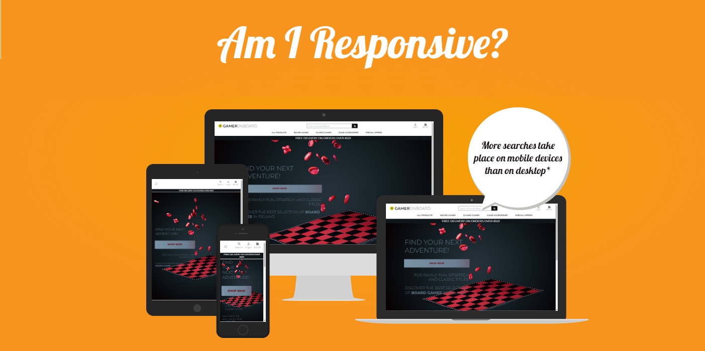
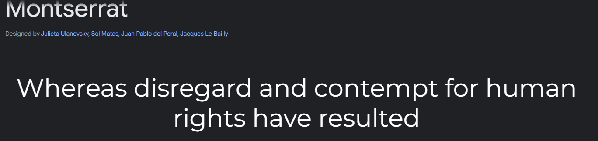
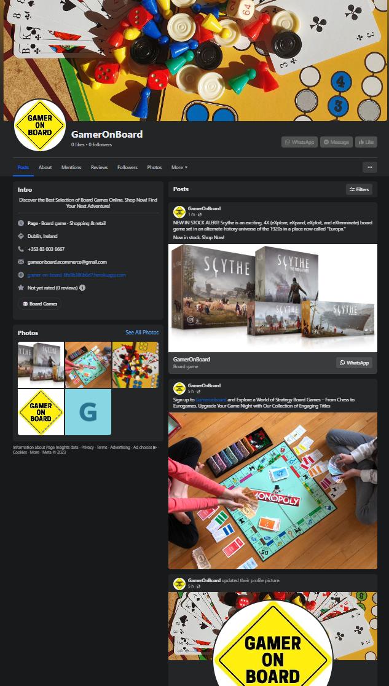

# Portfolio Project 5 - E-commerce Applications


## __Roll, Play, Win – GamerOnBoard is Your Board Game Destination.__

GamerOnBoard is a B2C (business-to-consumer) board game web store which aims to audiences, such as families, tabletop gamers, or collectors and specialising in strategic and role-playing board games. We have built a diverse and attractive inventory of board games, including popular titles such as Catan, Ticket to Ride, Chess, Monopoly and many many more... 

When designing GamerOnBoard store, I focused on creating a user-friendly, visually appealing e-commerce website with a responsive design and focused on implementing a secure and easy-to-navigate online shopping experience. One of my prorities was also to be able to optimise website for search engines (SEO) to improve organic visibility.

I ensured to include high-quality backlinks from reputable websites in the board game industry, gaming communities, and related niches.
The Customer is encourage to leave reviews and ratings, which can enhance GamerOnBoard visibility in local and product-specific search results.

# Project Goal

The goal of this project was to build a Full-Stack site based on business logic used to control a centrally-owned dataset. 
Page will have to have an authentication mechanism and provide paid access to the site's data and/or other activities based on the dataset, such as the purchase of a product/service. It is also a goal to implement SEO and create a dummy social media product page.

## __Tech Stack__

           


     

## __Live Web-Page__
<a href ='https://gamer-on-board-6fa9b306b6d7.herokuapp.com/' target="_blank">GamerOnBoard</a>

## __GitHub Repository__
<a href ='https://github.com/ShemmyYo/game-on-board-p5-ecommerce-app' target="_blank">https://github.com/ShemmyYo/game-on-board-p5-ecommerce-app</a>

***

# Contents

TBC


***

# UX User Experiance

**Creating a user-friendly e-commerce web store is essential to attract and retain customers hencethe below are some ofthe key UX (User Experience) characteristics I ensured to be used:** 

- **Intuitive Navigation:** Ensured that the website has a clear and logical navigation structure. Users should be able to easily find product categories, search for specific items, and navigate to their shopping cart or checkout page without confusion.

- **Responsive Design:** My e-commerce site is fully responsive, meaning it adapts seamlessly to various screen sizes and devices, including smartphones and tablets.

- **Fast Loading Speed:** I optimised store's performance to ensure fast load times by i.e.: compressing images.

- **Clear Product Presentation:** I used high-quality images and provided product descriptions. Include pricing, product specifications, and availability information as well as age group suitability and other.

- **User-Friendly Search:** I implemented a search feature which allow users to refine their search results by price, category, age, and other relevant criteria.

- **User Reviews and Ratings:** I includes user-generated reviews and ratings for products which builds trust and helps shoppers make informed decisions.

- **Shopping Cart and Checkout Optimization:** I made it easy for users to add items to their cart and proceed to checkout. I provided a clear and concise checkout process with Stripe payment option and guest checkout for convenience.

- **Security and Trust:** Displayed trust indicators such as secure payment logo.

- **Personalization:** Implement features like product recommendations based on user behavior and purchase history. Personalization enhances the shopping experience and can increase sales.

- **User Account Management:** Users are allowed to create accounts, save their address and view order history. AllAuth offers easy password recovery and account management options.

- **Error Handling:** Clear error messages and guidance when users encounter issues, such as out-of-stock products or incorrectly filled-out forms.

- **Accessibility:** I ensured that website is accessible to all users, including those with disabilities. 


## Design

### Colour Scheme

I opted for a very minimalistic aesthetic and only apllied 3 colours (2 with additional shades) to this project.

```css
root {
    --background-col: #fff;
    --background-accent: #7A92A5;
    --text-black: #0F1519;
    --text-gray: #6A92A5;
    --accent-col: #69101E;
    --accent-ligh: #A42435;
}
```

To provide a better user experience, I went for a light and neutral theme with an hints of red to add spice to the site. 
The colours have been implemented across the site and are included in the buttons/links and their hover effects.

I used  [Colormind](http://colormind.io/) colour scheme for this project:


[Back to top &uarr;](#contents)

### Typography

'Montserrat' has been used as a main font:

The old posters and signs in the traditional Montserrat neighborhood of Buenos Aires inspired Julieta Ulanovsky to design this typeface and rescue the beauty of urban typography that emerged in the first half of the twentieth century. As urban development changes that place, it will never return to its original form and loses forever the designs that are so special and unique. 



```font
root {
    --main-font: 'Montserrat', sans-serif;
}
```


***

### Imaginary

I designed a GamerOnBoard logo with  [Figma](https://www.figma.com/)

same logo has then been used to create [Favicon](https://favicon.io/) icons.


***

## Agile 

### The Ideal User/Persona

**Garry GameGeek**

- **Age:** 28
- **Gender:** Male
- **Occupation:** Software Developer
- **Hobbies:** Board games, video games, and attending gaming conventions
- **Location:** Urban area, lives in a small apartment
- **Income:** Middle-class
- **Marital Status:** Single
- **Education:** Bachelor's degree in Computer Science

**Tech-savvy:** Gary is comfortable using technology, especially when it comes to shopping online.
Social Gamer: He enjoys board games because they provide a great way to socialize with friends, either in-person or online.
Value Shopper: Gary is price-conscious and looks for good deals or discounts.
Game Collector: He is an avid board game collector and is always on the lookout for the latest and greatest titles.
Research-Oriented: Gary does extensive research before buying a game, reading reviews, and watching video tutorials.
Minimalist Lifestyle: Due to limited space in his apartment, Gary prefers games that are compact and versatile.
Environmental Consciousness: He cares about the environment and appreciates eco-friendly or sustainable game options.

**Goals:**
Discover new and exciting board games.
Get the best value for his money.
Stay up-to-date with the latest board game releases.
Find games suitable for various group sizes and occasions.

**Pain Points:**
Limited storage space for board games.
Worries about the environmental impact of buying new games.
Struggles to find time to attend physical board game events or conventions.
How the Online Board Game Shop Can Appeal to GameGeek Gary:

***
### Epics & Admin/User Stories

7 Epics (milestones) were created which were then further developed into 36 User Stories. 

 __[EPIC 1](https://github.com/ShemmyYo/game-on-board-p5-ecommerce-app/milestone/1)  Django & Project Basic Setup__

 As an ADMIN, I want to **setup Django app** so that I can start building my web store `MUST HAVE`  
 As an ADMIN,  I want to **create 'home' app** so that I can start creating base templates `MUST HAVE`  
 As an ADMIN, I want to be able to **configure and deploy to Heroku** so that my page is available for everyone to view `MUST HAVE`  
 As a USER, I want to be able to **clearly see the site's purpose** is so that I can decide whether or not to continue browsing it `MUST HAVE`   


 __[EPIC 2](https://github.com/ShemmyYo/game-on-board-p5-ecommerce-app/milestone/3)  User Authentication & Page Admin__

 As an ADMIN, I want **setup AllAuth** so that I can manage users from the Admin Panel  `MUST HAVE`  
 As an ADMIN, I will **make copies of allauth templates** so that I can adjust them to my user needs `MUST HAVE`  
 As a USER, I want to be able to **register my account** so that I can view my profile `SHOULD HAVE`   
 As a USER, I want to be able to **create a personalised user profile** so that I can re-use my details easily and view order history `SHOULD HAVE`   
 As a USER, I want to be able to **login and logout** so that I can access my account info `SHOULD HAVE`   
 As a USER, I want to be able to **get a confirmation email after registration** so that I can verify my account has been successfully registered `SHOULD HAVE`  
 As an Admin I want to be able **let users sign in with SSO** so that *they can log in easily and securely**  `WONT HAVE` 


 __[EPIC 3](https://github.com/ShemmyYo/game-on-board-p5-ecommerce-app/milestone/2)  Product App__

 As an ADMIN/Product Owner, I want to be able to **add product** so that I add or increase stock  `MUST HAVE`  
 As an ADMIN/Product Owner, I want to be able to **edit or update product** so that change product price, description etc.  `MUST HAVE`  
 As an ADMIN/Product Owner, I want to be able to **delete product** so that I can remove it if it's not for sale `MUST HAVE`  
 As a USER, I want to be able to **identify deals, clearance areas and special offers** so that ** I can take advantage of special offers** `MUST HAVE`  
 As a USER, I want to be able to **view a list of products** so that I can browse and shop easily `MUST HAVE`  
 As a USER, I want to be able to **see a detailed view of the product** so that I can read details of the product. `MUST HAVE`  
 As a USER, I want to be able to **search the webpage** so that I can find specific products and check if it's in stock `SHOULD HAVE`  
 As a USER, I want to be able to **view product by category** so that find product I'm looking for quickly and easily `MUST HAVE`  
 As a USER, I want to be able to **sort available products** so that easily identify the best rated, best priced and by category products `MUST HAVE`  
 As a USER, I want to be able to **view additional details** such as age group, play time and number of players so that I am fully aware of benefits of the product I want to buy `COULD HAVE`  
 As a USER, I want to be able to **view a carousel of images** on the home page so that I feel engaged and enticed straight away `COULD HAVE`  
As a User, I want to be able to **like product** so that I can easily **view my liked products** `COULD HAVE`  
 As a User, I want the have the ability **to like product count** so that I can **clearly see how many people like the same product** `COULD HAVE`  


 __[EPIC 4](https://github.com/ShemmyYo/game-on-board-p5-ecommerce-app/milestone/4)  Bag, Checkout and Payment__

 As a USER, I want to be able to **add products to a bag** so that I can purchase products i want `MUST HAVE`   
 As a USER, I want to be able to **view the total of my purchas**e so that I'm in full control of what I am buying `MUST HAVE`   
 As a USER, I want to be able to **add/remove product quantity** so that I am in full control of how many items I am buying `MUST HAVE`   
 As a USER, I want to be able to **view my bag** so that view product info, quantity and price of my purchase `MUST HAVE`   
 As a USER, I want to be able to **enter payment info** so that I can check out easily `MUST HAVE`   
 As a USER, I want to feel that my **payment is safe and secure** so that I feel confident to provide my card details `MUST HAVE`   
 As a USER, I want to get **an email confirmation after my purchase** so that I keep a record of what I've purchased `MUST HAVE`   
 As a USER, I want to be able to type in a **discount code** so that I can avail of a shop promo `WONT HAVE`  


 __[EPIC 5](https://github.com/ShemmyYo/game-on-board-p5-ecommerce-app/milestone/5)  Subscriptions__   

 As a USER,  I want to be able to **subscribe to a newsletter** so that I'm being kept up to date with all things new at GamerOnBoard `SHOULD HAVE`  


 __[EPIC 6](https://github.com/ShemmyYo/game-on-board-p5-ecommerce-app/milestone/6)  Reviews and Blog__   

 As a site user, I want to be able to view blog posts on the website so that I can read any posts/comments `COULD HAVE`   
 As a User, I want to be able to create blog posts from the front end so that I can share information with site visitors `COULD HAVE`   
 As a User, I want to be able to edit existing blog posts so that I can ensure that posts are up to date  `COULD HAVE`   
 As a User, I want to be able to delete existing blog posts so that I can remove any unwanted posts from the site `COULD HAVE`   


 __[EPIC 7](https://github.com/ShemmyYo/game-on-board-p5-ecommerce-app/milestone/7)  Marketing and Search Engine Optimalisation__

 As an ADMIN, I want to be able to - Marketing `MUST HAVE`   
 As an ADMIN, I want to be able to - Social Media `MUST HAVE`   
 As an ADMIN, I want to be able to - Social Media Extra `SHOULD HAVE` 


[Back to top &uarr;](#contents)

***
### MoSCoW Prioritization

This project was developed using agile methodologies by delivering small features (User Stories) across the project.

The Kanban board was created using Github projects and can be located [here](https://github.com/users/ShemmyYo/projects/6) and can be viewed to see more information on the project cards. 

Using this approach, I was able to apply the MoSCow prioritization and label user stories.
User Stories were assigned to Epics, prioritized under the labels:

- `MUST HAVE` - guaranteed to be delivered (*max 60% of stories*)
- `SHOULD HAVE` - adds significant value, but not vital (*the rest ~20% of stories*)
- `COULD HAVE` - has small impact if left out (*20% of stories*)
- `WON'T HAVE` - not a priority for this iteration

To ensure that all core requirements were completed I worked on the 'MUST HAVE' epics/user stories first.

A few `COULD HAVE` user stories have been implemented before project due date i.e. ...

[Back to top &uarr;](#contents)

***
## Wireframes

I've used [Balsamiq](https://balsamiq.com/wireframes) to create my page wireframes.

### Home Page Wireframes
<details>
<summary>Click to View Wireframes</summary>


</details>

***
### Sign Up Page Wireframes
<details>
<summary>Click to View Wireframes</summary>


</details>


***
### Login Page Wireframes
<details>
<summary>Click to View Wireframes</summary>


</details>


[Back to top &uarr;](#contents)

***
## Features

### Existing Features


[Back to top &uarr;](#contents)

***
__Error Pages__

- 404 Page not found
A 404 page has been implemented and will display if a user navigates to a broken link.

<details>
<summary>Click to View Error Page</summary>


</details>

- 403 Action Forbidden
A 403 error page has been implemented to provide feedback to the user when they try to access unauthorized content. 

- 500 Internal Server Error
A 500 error page has been displayed to alert users when an internal server error occurs. 

<details>
<summary>Click to View Error Page</summary>


</details>


[Back to top &uarr;](#contents)

***
### Future Features


[Back to top &uarr;](#contents)

***

## Ecommerce Business Model

GamerOnBoard is a B2C (business-to-consumer) as it sells goods to individual customers.

B2C model, the success of board game, online business will depend on ability to connect with individual consumers, offer a compelling product, and deliver exceptional customer service. Adapting and evolving business strategy based on consumer feedback and market trends will be crucial for long-term success.

### Web Marketing

GamerOnBoard has links for social media marketing, contact and newsletter model linked.

#### Social Media:
Social Media can potentially build a community of users around the business, and boost site visitor numbers,
especially when using larger platforms such a Facebook.

#### Newsletter:
A newsletter list can be used by the business to send regular messages to site users.
For example, what items are on special offer, new items in stock,
updates to business hours, notifications of events, and much more!

#### Other Google services available to boost business awareness:

- Google My Business - registering business address 
- Google Ads - powerfull advertising tool
- Google Analytics - visual analytics on clicks, track etc

#### GDPR:
 The European Union introduced the  General Data Protection Regulation, known as GDPR in May 2018. GDPR is the toughest privacy and security law in the world and even though it was passed by the European Union, it imposes obligations onto organizations anywhere in the world, as long as they target or collect data related to people in the EU.

 GamerOnBoard [Privacy Policy](https://www.privacypolicygenerator.info/live.php?token=IAqA6K5oi5wyOB0Wrs3XHhpYfMa3PMyi) has been generated and inluded in the footer of the page.

**Businesses and organizations that violate GDPR privacy and security standards**

[Back to top &uarr;](#contents)

***

### Search Engine Optimization (SEO)

Keyword research is the process of finding and analyzing search terms that people enter into search engines, with the goal of using that data for SEO or general web marketing.

#### Keywords

Keywords have been identified to align with my site, that should help users
when searching online to find my page easily from a search engine.
This included a series of the following keyword types

- Short-tail (head terms) keywords
These short-tail keywords can serve as the foundation for your SEO strategy. However, keeping in mind that competition for these keywords can be high, it's also essential to consider long-tail keywords and specific game titles to reach a more targeted audience. Additionally, regularly updating your website with fresh and relevant content, optimizing your site's structure, and acquiring backlinks from reputable sources can help improve search engine rankings.


| Long-tail keywords |    |              |
| ---------- | ---------- | ------------ |
| "Best board games" | "Board game collection" | "Top Game store" |
| "Tabletop games" | "Board game store" | "Board game retailer" |
| "Board game store near me" | "Buy board games" | "Tabletop game shop" |
| "Game board shop" | "Board games online" | "Best board games" |
| "Board games for sale" | "Game store online" | "Board games for adults" |
| "Board games for kids" | "Popular board games" | "Board games to buy" |
|  |  |  |


#### SEO Optimlisation

Website's content, including product descriptions, category pages, and blog posts, by incorporating chosen keywords naturally.
High-quality, informative, and engaging content that satisfies user intent and answers common questions related to board games.
Use header tags (H1, H2, H3, etc.) to structure your content and make it more readable:

**For the Homepage:**
 "Discover the Best Selection of Board Games Online. Shop Now for Family Fun, Strategy, and Classic Titles. Find Your Next Adventure!"

**For a Category Page (e.g., Strategy Board Games):**
 "Explore a World of Strategy Board Games – From Chess to Eurogames. Upgrade Your Game Night with Our Collection of Engaging Titles."

**For a Product Page (e.g., "Catan: Settlers of Catan Board Game"):**
 "Get Ready to Conquer Catan! Shop the Classic 'Settlers of Catan' Board Game. Build, Trade, and Win in this Award-Winning Title."

**For a Blog Post (e.g., "Top 10 Board Games for Family Game Night"):**
 "Planning a Family Game Night? Discover Our Top 10 Board Games for Unforgettable Fun. Start the Countdown to Laughter and Memories!"


#### External Link

- [The Boardgame Players Association](https://www.boardgamers.org/)
`The Boardgame Players Association started in 1991. The gaming convention which would eventually evolve into the present WBC got its start in 1991 as Avaloncon when years of campaigning for it by Don Greenwood finally convinced Avalon Hill management that a “return to basics” gaming convention emphasizing competitive play of the games was the best way for The Avalon Hill Game Company to reverse its flagging fortunes. Having started the Origins gaming convention two decades earlier—with all of 13 tournaments—Avalon Hill had freely relinquished control of that annual gaming fest to the fledgling Game Manufacturer’s Association to concentrate on the production of its own games.`

- [The Irish Games Association](https://iga.ie/)
`The Irish Games Association CLG is dedicated to promoting gaming in Ireland, by running, supporting and publicising gaming events, while seeking to communicate and cooperate with others that do likewise. The IGA engages in a number of activities designed to further its stated aim of promoting gaming in Ireland and has evolved substantially over its lifespan. Originally, the IGA was a group composed of different gaming interests from around the country who came together to organise an event known as Convention: Gaelcon. Since that time, a number of changes have taken place, and the IGA has expanded into other fields. The goal of the IGA is to help the gaming community in whatever way possible, be it by organising events, providing information, or offering what assistance it can to others who are working on behalf of the gaming community in Ireland. If you are running an event and need some assistance or some friendly advice please don’t hesitate to reach out to us.`


#### META:

 | META keywords |    |              |  |  |  
 | ---------- | ---------- | ------------ | ----------- | ----------- |   
 | Board | Tabletop | Card | Strategy | Family board |  
 | Board game store | Game night | Role-playing games (RPGs) | Classic board | Board game recommendations |   
 | Board game shop  | Party games | Board game collection | Board game accessories | Board game reviews |  
 |  |  |  |  |  |  

#### Sitemap

I've used [XML-Sitemaps](https://www.xml-sitemaps.com) to generate a sitemap.xml file.
File generated using deployed site URL: https://gamer-on-board-6fa9b306b6d7.herokuapp.com/

After it finished crawling the entire site, it created a
[sitemap.xml](sitemap.xml) which I've downloaded and included in the repository's root dir.

#### Robots

I've created the [robots.txt](robots.txt) file at the root-level.
Inside, I've included the default settings:

```
User-agent: *
Disallow:
Sitemap: https://gamer-on-board-6fa9b306b6d7.herokuapp.com/sitemap.xml
```

[Back to top &uarr;](#contents)

***

### Social Media Marketing

Social marketing in the context of online business refers to the use of social media platforms and strategies to promote products or services, build brand awareness, engage with customers, and ultimately drive sales and business growth. It's an essential component of digital marketing that leverages the vast reach and influence of social media to connect with potential customers. 

Common platforms include Facebook, Instagram, Twitter, LinkedIn, Pinterest, and TikTok.

Social marketing in online business is an ongoing effort that requires a deep understanding of your target audience and the ability to adapt to the ever-changing landscape of social media. It's essential to maintain a strategic and customer-focused approach to maximize your online business's success through social media channels.

I've started this journey by creating a Facebook account



[Back to top &uarr;](#contents)

***

### Newsletter Marketing

I have incorporate a newsletter sign-up form on my application, to allow users to supply their
email address if they are interested in learning more about what the business has to offer.

I created a custom newsletter app in my project with a custom NewsletterSignup model and added a form to the site's footer to collect user email addresses 

Newsletter model:

```python
class NewsletterSignup(models.Model):
    email = models.EmailField(unique=True, null=False, blank=False)

    def __str__(self):
        return self.email
```

I set the email address to be unique to avoid users signing up multiple times with the same email address. 
If a user tries to sign up twice with the same address they will be shown a message letting them know they've already signed up.

Once a user signs up, I used the `send_mail()` functionality in the `webhook_handler.py` file to trigger a welcome email for the user to acknowledge that they've successfully signed up for the newsletter.

[Back to top &uarr;](#contents)

***

## Testing

[TESTING.md](TESTING.md) file.

[Back to top &uarr;](#contents)

***

## Tools & technologies used

### Languages Used

- [HTML5](https://html.spec.whatwg.org/) used for page content and structure 
- [CSS](https://www.w3.org/Style/CSS/Overview.en.html) used for page styling
- [Javascript](https://www.javascript.com/) used for dynamically updated content
- [Python](https://www.python.org/) - used for the functionality of the program

### Frameworks & Tools

- [Django](https://www.djangoproject.com/) used as main python framework
- [Stripe Payments](https://stripe.com/) Payments infrastructure for the Internet
- [Bootstrap](https://blog.getbootstrap.com/) used for page layout and spacing
- [PostgreSQL](https://www.postgresql.org) used for database management
- [ElephantSQL](https://www.elephantsql.com/) used for production database
- [Heroku](https://dashboard.heroku.com/apps) used to deploy application
- [Gitpod](https://www.gitpod.io/) used to create and host the website
- [Github](https://github.com/) used to deploy the website 
- [Balsamiq](https://balsamiq.com/) used to create page wireframes
- [Stackoverflow](https://stackoverflow.com/) used to troubleshoot code issues
- [CI Python Linter](https://pep8ci.herokuapp.com/) used as Python code validator
- [Chrome Dev Tools](https://developer.chrome.com/docs/devtools/)
- [Grammarly](https://www.grammarly.com/) used to check typography
- [Am I Responsive](https://amiresponsive.co.uk/) mockup image of the home page on various devices 

### Imported Libraries and Packages

- [gunicorn]() - Python WSGI HTTP Server for UNIX
- [psycopg2]() - PostgreSQL database adapter for Python
- [cloudinary]() - Python package allowing integration between the application and Cloudinary
- [dj-database-url]() - Django utility to utilise the DATABASE_URL environment variable to configure the Django application. Used with PostgreSQL
- [Django]() - Python package for the Django framework
- [django-allauth]() - Django user authentication, registration and account management
- [django-crispy-forms]() - Django package that provides tags and filters to control the rendering behaviour of Django forms

[Back to top &uarr;](#contents)

### Data Model


[Back to top &uarr;](#contents)

## Testing

For all testing, please refer to the [TESTING.md](TESTING.md) file.


***
## Deployment

The live deployed application can be found deployed on [Heroku](https://shemmylicious.herokuapp.com).

***
### ElephantSQL Database

This project uses [ElephantSQL](https://www.elephantsql.com) for the PostgreSQL Database.

To obtain your own Postgres Database, sign-up with your GitHub account, then follow these steps:
- Click **Create New Instance** to start a new database.
- Provide a name (this is commonly the name of the project: tribe).
- Select the **Tiny Turtle (Free)** plan.
- You can leave the **Tags** blank.
- Select the **Region** and **Data Center** closest to you.
- Once created, click on the new database name, where you can view the database URL and Password.

[Back to top &uarr;](#contents)

***
### Cloudinary API

This project uses the [Cloudinary API](https://cloudinary.com) to store media assets online, due to the fact that Heroku doesn't persist this type of data.

To obtain your own Cloudinary API key, create an account and log in.
- For *Primary interest*, you can choose *Programmable Media for image and video API*.
- Optional: *edit your assigned cloud name to something more memorable*.
- On your Cloudinary Dashboard, you can copy your **API Environment Variable**.
- Be sure to remove the `CLOUDINARY_URL=` as part of the API **value**; this is the **key**.

[Back to top &uarr;](#contents)

***
### Heroku Deployment

[Setting up basic Django Project and Deploying to Heroku CI Doc](https://docs.google.com/document/d/1P5CWvS5cYalkQOLeQiijpSViDPogtKM7ZGyqK-yehhQ/edit)

This project uses [Heroku](https://www.heroku.com), a platform as a service (PaaS) that enables developers to build, run, and operate applications entirely in the cloud.

Deployment steps are as follows, after account setup:

1. Select *New* in the top-right corner of your Heroku Dashboard, and select *Create new app* from the dropdown menu.
1. Your app name must be unique, and then choose a region closest to you (EU or USA), and finally, select *Create App*.
1. Further down, to support dependencies, select *Add Buildpack*.
1. The order of the buildpacks is important, select `Python` first, then `Node.js` second. (if they are not in this order, you can drag them to rearrange them)
1. From the new app *Settings*, click *Reveal Config Vars*, and set your environment variables.

    
    - CLOUNDINARY_URL: (Enter Cloudinary API URL)
    - DATABASE_URL: (Enter the database URL from ElephantSQL)
    - PORT: 8000
    - DISABLE_COLLECTSTATIC: 1 (must be removed before final deployment)
    - SECRET_KEY: (Enter your secret key)

Heroku needs two additional files in order to deploy properly.
- requirements.txt
- Procfile

You can install this project's *requirements* (where applicable) using:
- `pip3 install -r requirements.txt`

If you have your own packages that have been installed, then the requirements file needs updated using:
- `pip3 freeze --local > requirements.txt`

The *Procfile* can be created with the following command:
- `echo web: gunicorn app_name.wsgi > Procfile`
- *replace *app_name* with the name of your primary Django app name; the folder where settings.py is located*

For Heroku deployment, follow these steps to connect your own GitHub repository to the newly created app:

Either:
- Select *Automatic Deployment* from the Heroku app.

Or:
- In the Terminal/CLI, connect to Heroku using this command: `heroku login -i`
- Set the remote for Heroku: `heroku git:remote -a <app_name>` (replace app_name with your app, without the angle-brackets)
- After performing the standard Git `add`, `commit`, and `push` to GitHub, you can now type:
	- `git push heroku main`

The project should now be connected and deployed to Heroku!

[Back to top &uarr;](#contents)

***
### Local Deployment

This project can be cloned or forked in order to make a local copy on your own system.

For either method, you will need to install any applicable packages found within the *requirements.txt* file.
- `pip3 install -r requirements.txt`.

You will need to create a new file called `env.py` at the root-level,
and include the same environment variables listed above from the Heroku deployment steps.

Sample `env.py` file:

```python
import os

os.environ.setdefault("CLOUDINARY_URL", "insert your own Cloudinary API key here")
os.environ.setdefault("DATABASE_URL", "insert your own ElephantSQL database URL here")
os.environ.setdefault("SECRET_KEY", "this can be any random secret key")

# local environment only (do not include these in production/deployment!)
os.environ.setdefault("DEBUG", "True")
```

Once the project is cloned or forked, in order to run it locally, you'll need to follow these steps:
- Start the Django app: `python3 manage.py runserver`
- Stop the app once it's loaded: `CTRL+C` or `⌘+C` (Mac)
- Make any necessary migrations: `python3 manage.py makemigrations`
- Migrate the data to the database: `python3 manage.py migrate`
- Create a superuser: `python3 manage.py createsuperuser`
- Load fixtures (if applicable): `python3 manage.py loaddata file-name.json` (repeat for each file)
- Everything should be ready now, so run the Django app again: `python3 manage.py runserver`

[Back to top &uarr;](#contents)

***
#### Cloning

You can clone the repository by following these steps:

1. Go to the [GitHub repository](https://github.com/ShemmyYo/game-on-board-p5-ecommerce-app) 
2. Locate the Code button above the list of files and click it 
3. Select if you prefer to clone using HTTPS, SSH, or GitHub CLI and click the copy button to copy the URL to your clipboard
4. Open Git Bash or Terminal
5. Change the current working directory to the one where you want the cloned directory
6. In your IDE Terminal, type the following command to clone my repository:
	- `git clone https://github.com/ShemmyYo/game-on-board-p5-ecommerce-app.git`
7. Press Enter to create your local clone.

Alternatively, if using Gitpod, you can click below to create your own workspace using this repository.

[](https://gitpod.io/#https://github.com/ShemmyYo/)

Please note that in order to directly open the project in Gitpod, you need to have the browser extension installed.
A tutorial on how to do that can be found [here](https://www.gitpod.io/docs/configure/user-settings/browser-extension).

[Back to top &uarr;](#contents)

***
#### Forking

By forking the GitHub Repository, we make a copy of the original repository on our GitHub account to view and/or make changes without affecting the original owner's repository.
To make a copy or ‘fork’ the repository - 

1. Log into GitHub and locate the repository  
2. On the right-hand side of the page select the ‘fork’ option to create and copy the original

Alternatively, if using Gitpod, you can click below to create your workspace using this repository

[Back to top &uarr;](#contents)

***
## Credits

Throughout the building process I found many helpful tutorials online.
I sometimes applied principles within them to the site, after fully understanding their code and modifying to fit the site's needs.

1. [Code Institute Template](https://github.com/Code-Institute-Org/python-essentials-template) - This repository was created using the template provided by Code Institute.
1. [Django Documentation](https://docs.djangoproject.com/en/4.0/) - Django step-by-step document to ensure everything is set up correctly.
1. [Setting up basic Django Project and Deploying to Heroku](https://docs.google.com/document/d/1P5CWvS5cYalkQOLeQiijpSViDPogtKM7ZGyqK-yehhQ/edit) - Documentation on how to create django project provided by [Code Institute](https://codeinstitute.net/ie/) 
1. [Allauth Documentation](https://django-allauth.readthedocs.io/en/latest/faq.html) - referenced during development.
1. [Cloudinary Documentation](https://cloudinary.com) - referenced during development.
1. [Summernote Documentation](https://summernote.org/) and [Git](https://github.com/summernote/django-summernote) - referenced during development.
1. [Crispy Forms Documentation](https://django-crispy-forms.readthedocs.io/en/latest/) - referenced during development.

1. [Stackoverflow](https://stackoverflow.com/) - I found myself on Stackoverflow so many times researching issues. This a fantastic place to learn and troubleshoot code.
1. [Slack](https://slack.com/intl/en-ie/) - The slack community is great and I reached out to fellow students who had already completed their P4 for their advice and got some nice tips and feedback. I attending some webinars by CI staff which I found very beneficial.

1. [unsplash](https://unsplash.com/s/photos/Sauce) - Graphics used on the page
1. [Markdown Builder by Tim Nelson](https://traveltimn.github.io/markdown-builder/) - tool to help generating some parts of the Markdown files

***
## Acknowledgements

As always, big thank you to [Harry Dhillon](https://github.com/Harry-Leepz), my mentor who provided me with guide and excellent feedback throughout the project

Shemmylicious Food was developed for educational purpouses and as part of my Diploma in Software Development with [Code Institute](https://codeinstitute.net/). 

[Back to top &uarr;](#contents)
