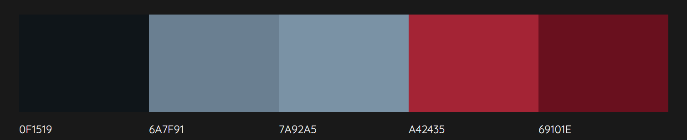
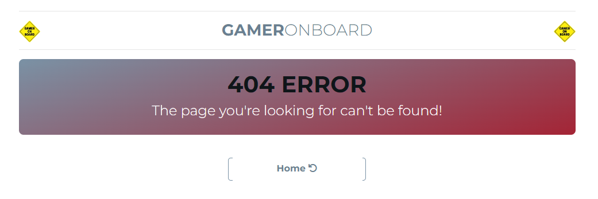
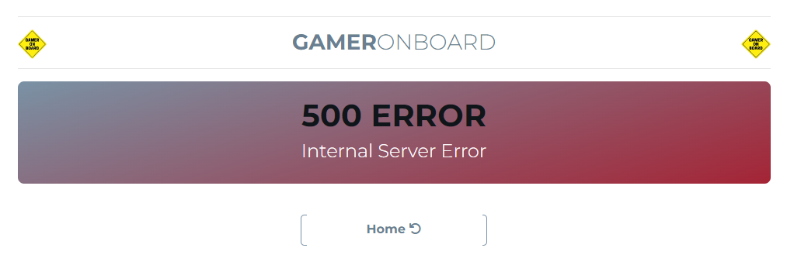

# Portfolio Project 5 - E-commerce Applications


## __Roll, Play, Win – Game On Board is Your Board Game Destination.__

GameOnBoard is a B2C (business-to-consumer) board game web store which aims to audiences, such as families, tabletop gamers, or collectors and specialising in strategic and role-playing board games. We have built a diverse and attractive inventory of board games, including popular titles such as …….. 

When designing GameOnBoard.ie page, I focused on creating a user-friendly, visually appealing e-commerce website with a responsive design and focused on implementing a secure and easy-to-navigate online shopping experience. One of my prorities was also to be able to optimise website for search engines (SEO) to improve organic visibility.

TBC


You can view the live, deployed to Heroku application here: <a href ='https://gameonboard.herokuapp.com/' target="_blank">Game On Board</a>


## __Live Web-Page__
[GameOnBoard](https://gameonboard.herokuapp.com)

## __Live Web-Page__
[GameOnBoard](https://shemmylicious.herokuapp.com/)

## __GitHub Repository__
[https://github.com/ShemmyYo/game-on-board-p5-ecommerce-app](https://github.com/ShemmyYo/game-on-board-p5-ecommerce-app)

## __Tech Stack__

           


      

***

# Contents

TBC


***

# Project Goal

***

# UX User Experiance

## Design

### Colour Scheme



[Back to top &uarr;](#contents)

### Typography
***

### Imaginary
***

## Agile 

### The Ideal User/Persona

***
### Epics & Admin/User Stories

7 Epics (milestones) were created which were then further developed into XX User Stories. 

__EPIC: [Initial Django Setup](https://github.com/ShemmyYo/...)__


[Back to top &uarr;](#contents)

TBC


***
### MoSCoW Prioritization

This project was developed using agile methodologies by delivering small features (User Stories) across the project.

The Kanban board was created using Github projects and can be located [here](https://github.com/users/ShemmyYo/projects/6) and can be viewed to see more information on the project cards. 

Using this approach, I was able to apply the MoSCow prioritization and label user stories.
User Stories were assigned to Epics, prioritized under the labels:

- `MUST HAVE` - guaranteed to be delivered (*max 60% of stories*)
- `SHOULD HAVE` - adds significant value, but not vital (*the rest ~20% of stories*)
- `COULD HAVE` - has small impact if left out (*20% of stories*)
- `WON'T HAVE` - not a priority for this iteration

To ensure that all core requirements were completed I worked on the 'MUST HAVE' epics/user stories first.

A few `COULD HAVE` user stories have been implemented before project due date i.e. ...

[Back to top &uarr;](#contents)

***
## Wireframes

I've used [Balsamiq](https://balsamiq.com/wireframes) to create my page wireframes.

### Home Page Wireframes
<details>
<summary>Click to View Wireframes</summary>


</details>

***
### Sign Up Page Wireframes
<details>
<summary>Click to View Wireframes</summary>


</details>


***
### Login Page Wireframes
<details>
<summary>Click to View Wireframes</summary>


</details>


[Back to top &uarr;](#contents)

***
## Features

### Existing Features


[Back to top &uarr;](#contents)

***
__Error Pages__

- 404 Page not found
A 404 page has been implemented and will display if a user navigates to a broken link.

<details>
<summary>Click to View Error Page</summary>


</details>

- 403 Action Forbidden
A 403 error page has been implemented to provide feedback to the user when they try to access unauthorized content. 

- 500 Internal Server Error
A 500 error page has been displayed to alert users when an internal server error occurs. 

<details>
<summary>Click to View Error Page</summary>


</details>


[Back to top &uarr;](#contents)

***
### Future Features


[Back to top &uarr;](#contents)

***

## Tools & technologies used

### Languages Used

- [HTML5](https://html.spec.whatwg.org/) used for page content and structure 
- [CSS](https://www.w3.org/Style/CSS/Overview.en.html) used for page styling
- [Javascript](https://www.javascript.com/) used for dynamically updated content
- [Python](https://www.python.org/) - used for the functionality of the program

### Frameworks & Tools

- [Django](https://www.djangoproject.com/) used as main python framework
- [Stripe Payments](https://stripe.com/) Payments infrastructure for the Internet
- [Bootstrap](https://blog.getbootstrap.com/) used for page layout and spacing
- [PostgreSQL](https://www.postgresql.org) used for database management
- [ElephantSQL](https://www.elephantsql.com/) used for production database
- [Cloudinary](https://cloudinary.com/) used to store static files and images
- [Heroku](https://dashboard.heroku.com/apps) used to deploy application
- [Gitpod](https://www.gitpod.io/) used to create and host the website
- [Github](https://github.com/) used to deploy the website 
- [Balsamiq](https://balsamiq.com/) used to create page wireframes
- [Stackoverflow](https://stackoverflow.com/) used to troubleshoot code issues
- [CI Python Linter](https://pep8ci.herokuapp.com/) used as Python code validator
- [Chrome Dev Tools](https://developer.chrome.com/docs/devtools/)
- [Grammarly](https://www.grammarly.com/) used to check typography
- [Technisini](https://techsini.com/multi-mockup/index.php) mockup image of the home page on various devices 

### Imported Libraries and Packages

- [gunicorn]() - Python WSGI HTTP Server for UNIX
- [psycopg2]() - PostgreSQL database adapter for Python
- [cloudinary]() - Python package allowing integration between the application and Cloudinary
- [dj-database-url]() - Django utility to utilise the DATABASE_URL environment variable to configure the Django application. Used with PostgreSQL
- [Django]() - Python package for the Django framework
- [django-allauth]() - Django user authentication, registration and account management
- [django-crispy-forms]() - Django package that provides tags and filters to control the rendering behaviour of Django forms

[Back to top &uarr;](#contents)

### Data Model


[Back to top &uarr;](#contents)

## Testing

For all testing, please refer to the [TESTING.md](TESTING.md) file.


***
## Deployment

The live deployed application can be found deployed on [Heroku](https://shemmylicious.herokuapp.com).

***
### ElephantSQL Database

This project uses [ElephantSQL](https://www.elephantsql.com) for the PostgreSQL Database.

To obtain your own Postgres Database, sign-up with your GitHub account, then follow these steps:
- Click **Create New Instance** to start a new database.
- Provide a name (this is commonly the name of the project: tribe).
- Select the **Tiny Turtle (Free)** plan.
- You can leave the **Tags** blank.
- Select the **Region** and **Data Center** closest to you.
- Once created, click on the new database name, where you can view the database URL and Password.

[Back to top &uarr;](#contents)

***
### Cloudinary API

This project uses the [Cloudinary API](https://cloudinary.com) to store media assets online, due to the fact that Heroku doesn't persist this type of data.

To obtain your own Cloudinary API key, create an account and log in.
- For *Primary interest*, you can choose *Programmable Media for image and video API*.
- Optional: *edit your assigned cloud name to something more memorable*.
- On your Cloudinary Dashboard, you can copy your **API Environment Variable**.
- Be sure to remove the `CLOUDINARY_URL=` as part of the API **value**; this is the **key**.

[Back to top &uarr;](#contents)

***
### Heroku Deployment

[Setting up basic Django Project and Deploying to Heroku CI Doc](https://docs.google.com/document/d/1P5CWvS5cYalkQOLeQiijpSViDPogtKM7ZGyqK-yehhQ/edit)

This project uses [Heroku](https://www.heroku.com), a platform as a service (PaaS) that enables developers to build, run, and operate applications entirely in the cloud.

Deployment steps are as follows, after account setup:

1. Select *New* in the top-right corner of your Heroku Dashboard, and select *Create new app* from the dropdown menu.
1. Your app name must be unique, and then choose a region closest to you (EU or USA), and finally, select *Create App*.
1. Further down, to support dependencies, select *Add Buildpack*.
1. The order of the buildpacks is important, select `Python` first, then `Node.js` second. (if they are not in this order, you can drag them to rearrange them)
1. From the new app *Settings*, click *Reveal Config Vars*, and set your environment variables.

    
    - CLOUNDINARY_URL: (Enter Cloudinary API URL)
    - DATABASE_URL: (Enter the database URL from ElephantSQL)
    - PORT: 8000
    - DISABLE_COLLECTSTATIC: 1 (must be removed before final deployment)
    - SECRET_KEY: (Enter your secret key)

Heroku needs two additional files in order to deploy properly.
- requirements.txt
- Procfile

You can install this project's *requirements* (where applicable) using:
- `pip3 install -r requirements.txt`

If you have your own packages that have been installed, then the requirements file needs updated using:
- `pip3 freeze --local > requirements.txt`

The *Procfile* can be created with the following command:
- `echo web: gunicorn app_name.wsgi > Procfile`
- *replace *app_name* with the name of your primary Django app name; the folder where settings.py is located*

For Heroku deployment, follow these steps to connect your own GitHub repository to the newly created app:

Either:
- Select *Automatic Deployment* from the Heroku app.

Or:
- In the Terminal/CLI, connect to Heroku using this command: `heroku login -i`
- Set the remote for Heroku: `heroku git:remote -a <app_name>` (replace app_name with your app, without the angle-brackets)
- After performing the standard Git `add`, `commit`, and `push` to GitHub, you can now type:
	- `git push heroku main`

The project should now be connected and deployed to Heroku!

[Back to top &uarr;](#contents)

***
### Local Deployment

This project can be cloned or forked in order to make a local copy on your own system.

For either method, you will need to install any applicable packages found within the *requirements.txt* file.
- `pip3 install -r requirements.txt`.

You will need to create a new file called `env.py` at the root-level,
and include the same environment variables listed above from the Heroku deployment steps.

Sample `env.py` file:

```python
import os

os.environ.setdefault("CLOUDINARY_URL", "insert your own Cloudinary API key here")
os.environ.setdefault("DATABASE_URL", "insert your own ElephantSQL database URL here")
os.environ.setdefault("SECRET_KEY", "this can be any random secret key")

# local environment only (do not include these in production/deployment!)
os.environ.setdefault("DEBUG", "True")
```

Once the project is cloned or forked, in order to run it locally, you'll need to follow these steps:
- Start the Django app: `python3 manage.py runserver`
- Stop the app once it's loaded: `CTRL+C` or `⌘+C` (Mac)
- Make any necessary migrations: `python3 manage.py makemigrations`
- Migrate the data to the database: `python3 manage.py migrate`
- Create a superuser: `python3 manage.py createsuperuser`
- Load fixtures (if applicable): `python3 manage.py loaddata file-name.json` (repeat for each file)
- Everything should be ready now, so run the Django app again: `python3 manage.py runserver`

[Back to top &uarr;](#contents)

***
#### Cloning

You can clone the repository by following these steps:

1. Go to the [GitHub repository](https://github.com/ShemmyYo/game-on-board-p5-ecommerce-app) 
2. Locate the Code button above the list of files and click it 
3. Select if you prefer to clone using HTTPS, SSH, or GitHub CLI and click the copy button to copy the URL to your clipboard
4. Open Git Bash or Terminal
5. Change the current working directory to the one where you want the cloned directory
6. In your IDE Terminal, type the following command to clone my repository:
	- `git clone https://github.com/ShemmyYo/game-on-board-p5-ecommerce-app.git`
7. Press Enter to create your local clone.

Alternatively, if using Gitpod, you can click below to create your own workspace using this repository.

[](https://gitpod.io/#https://github.com/ShemmyYo/)

Please note that in order to directly open the project in Gitpod, you need to have the browser extension installed.
A tutorial on how to do that can be found [here](https://www.gitpod.io/docs/configure/user-settings/browser-extension).

[Back to top &uarr;](#contents)

***
#### Forking

By forking the GitHub Repository, we make a copy of the original repository on our GitHub account to view and/or make changes without affecting the original owner's repository.
To make a copy or ‘fork’ the repository - 

1. Log into GitHub and locate the repository  
2. On the right-hand side of the page select the ‘fork’ option to create and copy the original

Alternatively, if using Gitpod, you can click below to create your workspace using this repository

[Back to top &uarr;](#contents)

***
## Credits

Throughout the building process I found many helpful tutorials online.
I sometimes applied principles within them to the site, after fully understanding their code and modifying to fit the site's needs.

1. [Code Institute Template](https://github.com/Code-Institute-Org/python-essentials-template) - This repository was created using the template provided by Code Institute.
1. [Django Documentation](https://docs.djangoproject.com/en/4.0/) - Django step-by-step document to ensure everything is set up correctly.
1. [Setting up basic Django Project and Deploying to Heroku](https://docs.google.com/document/d/1P5CWvS5cYalkQOLeQiijpSViDPogtKM7ZGyqK-yehhQ/edit) - Documentation on how to create django project provided by [Code Institute](https://codeinstitute.net/ie/) 
1. [Allauth Documentation](https://django-allauth.readthedocs.io/en/latest/faq.html) - referenced during development.
1. [Cloudinary Documentation](https://cloudinary.com) - referenced during development.
1. [Summernote Documentation](https://summernote.org/) and [Git](https://github.com/summernote/django-summernote) - referenced during development.
1. [Crispy Forms Documentation](https://django-crispy-forms.readthedocs.io/en/latest/) - referenced during development.

1. [Stackoverflow](https://stackoverflow.com/) - I found myself on Stackoverflow so many times researching issues. This a fantastic place to learn and troubleshoot code.
1. [Slack](https://slack.com/intl/en-ie/) - The slack community is great and I reached out to fellow students who had already completed their P4 for their advice and got some nice tips and feedback. I attending some webinars by CI staff which I found very beneficial.

1. [unsplash](https://unsplash.com/s/photos/Sauce) - Graphics used on the page
1. [Markdown Builder by Tim Nelson](https://traveltimn.github.io/markdown-builder/) - tool to help generating some parts of the Markdown files

***
## Acknowledgements

As always, big thank you to [Harry Dhillon](https://github.com/Harry-Leepz), my mentor who provided me with guide and excellent feedback throughout the project

Shemmylicious Food was developed for educational purpouses and as part of my Diploma in Software Development with [Code Institute](https://codeinstitute.net/). 

[Back to top &uarr;](#contents)
