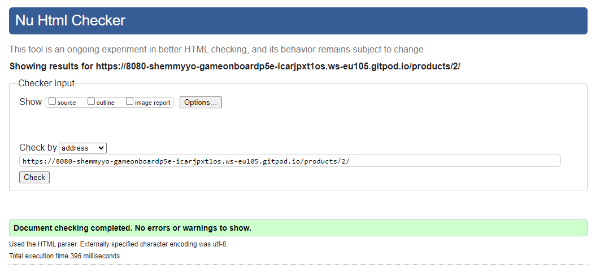
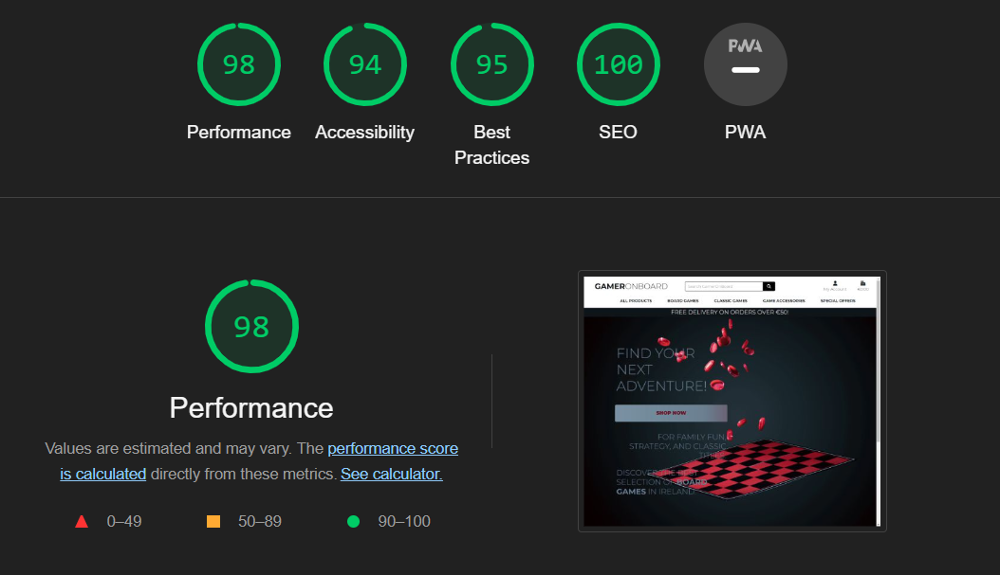
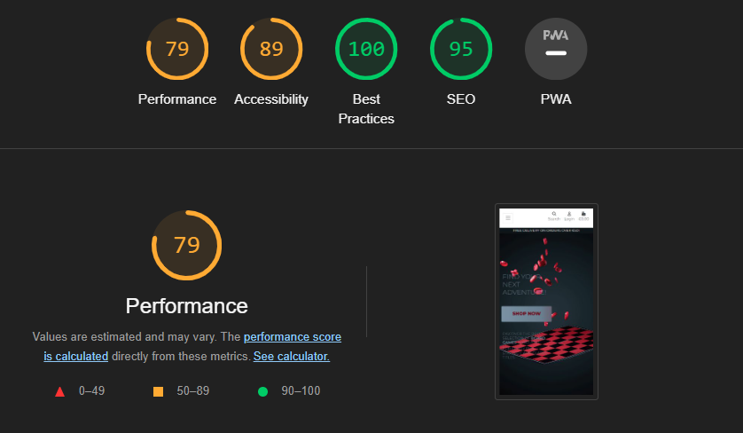
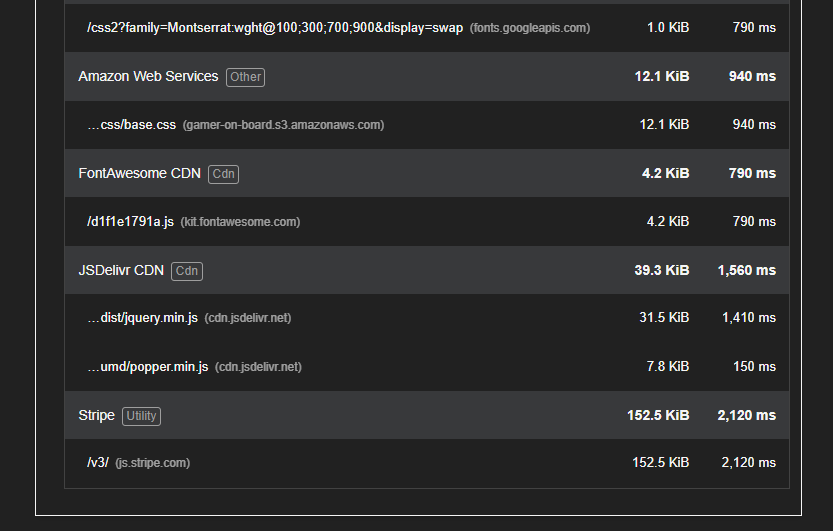
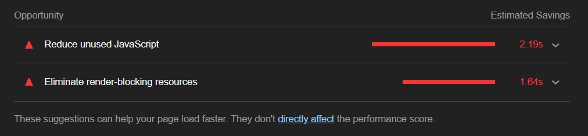
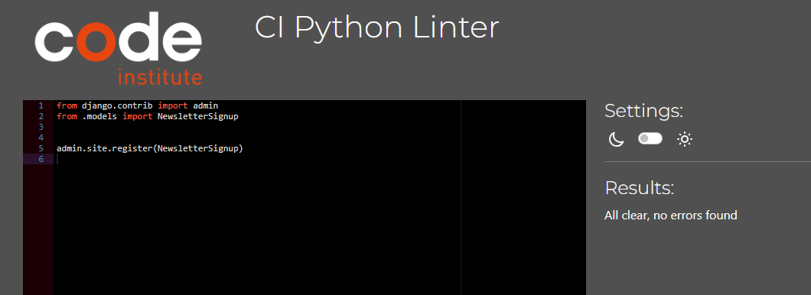
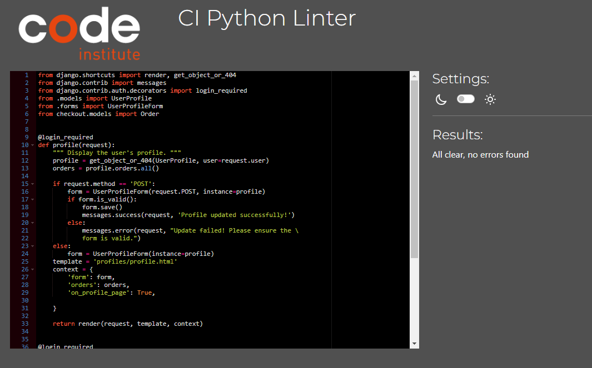

Back to [README.md](README.md) file.

# Browser Compatibility

After publishing to Heroku, the site was tested on Google Chrome, Microsoft Edge, Safari and Mozilla Firefox, with no visible issues for the user. 

The site has loaded correctly and had no issues across all browsers.

[Back to top &uarr;](#browser-compatibility)

# __Validation__

##  __HTML__

All pages were run through the [W3C Markup Validator](https://validator.w3.org/nu/). 

Initially, there were some errors however all errors have been rectified.

 >>> Click for Home validation img

 >>> Click for Product validation img

 >>> Click for Product detaills validation img

 >>> Click for Add Product validation img

 >>> Click for Edit Product validation img

 >>> Click for Profile Update validation img

 >>> Click for Register Profile validation img

 >>> Click for Profile Login validation img

 >>> Click for Profile Logout validation img

[Back to top &uarr;](#browser-compatibility)

***

##  __CSS__
[W3C CSS Validator](https://jigsaw.w3.org/css-validator/) was used to validate the site's CSS code.

All issued rectified.

 >>> Click for CSS base validation img

 >>> Click for CSS checkout validation img

 >>> Click for CSS profile validation img

[Back to top &uarr;](#browser-compatibility)

***

##  __JS__

[JSHint](https://jshint.com/) was used to validate the Javascript code used in the project. 

No issues to report.

 >>> Click for JSHint products script validation img

 >>> Click for JSHint product details script validation img

 >>> Click for JSHint edit product script validation img

 >>> Click for JSHint bag script validation img

 >>> Click for JSHint quantity input script validation img

 >>> Click for JSHint stripe elements script validation img

[Back to top &uarr;](#browser-compatibility)

***

##  __Lighthouse__

Every page of the site was passed through the Lighthouse via the Chrome Dev Tools.

Performance issued are due mainly to image sizing however, some pages have shown also unused js code usage (GSAP code which in only used on index page) 

 >>> Click for Home Page Lighthouse Report

Desktop 

Mobile

 >>> Click for Product Lighthouse Report img

Desktop 

Mobile

 >>> Click for Product details Lighthouse Report img

Desktop 

Mobile

 >>> Click for Add Product Lighthouse Report img

Desktop 

Mobile

 >>> Click for Edit Product Lighthouse Report img

Desktop 

Mobile

 >>> Click for Profile UpdateLighthouse Report img

Desktop 

Mobile

 >>> Click for Register Profile Lighthouse Report img

Desktop 

Mobile

 >>> Click for Profile Login Lighthouse Report img

Desktop 

Mobile

 >>> Click for Profile Logout Lighthouse Report img

Desktop

Mobile

[Back to top &uarr;](#browser-compatibility)

***

##  __PEP8 CI Validation__

The [CI Python Linter](https://pep8ci.herokuapp.com/) was used to validate the python code used throughout the project. The results are outlined in below:

***

app: __gameronboard__

 >>> Click for urls.py validation img

***

app: __home__

 >>> Click for urls.py validation img

 >>> Click for views.py validation img

 >>> Click for apps.py validation img

[Back to top &uarr;](#browser-compatibility)

***

app: __bag__

 >>> Click for urls.py validation img

 

 >>> Click for views.py validation img

 >>> Click for apps.py validation img

 >>> Click for context.py validation img

 

 >>> Click for bag_tools.py validation img

 

[Back to top &uarr;](#browser-compatibility)

***

app: __checkout__

 >>> Click for urls.py validation img

 >>> Click for views.py validation img

 >>> Click for forms.py validation img

 >>> Click for models.py validation img

 >>> Click for signals.py validation img

 >>> Click for admin.py validation img

 >>> Click for apps.py validation img

 >>> Click for webhook.py validation img

 >>> Click for webhook_handler.py validation img

[Back to top &uarr;](#browser-compatibility)

***

app: __newsletter__

 >>> Click for urls.py validation img

 >>> Click for views.py validation img

 >>> Click for forms.py validation img

 >>> Click for admin.py validation img

[Back to top &uarr;](#browser-compatibility)

***

app: __product__

 >>> Click for urls.py validation img

 >>> Click for views.py validation img

 >>> Click for forms.py validation img

 >>> Click for models.py validation img

 >>> Click for apps.py validation img

 >>> Click for widgets.py validation img

[Back to top &uarr;](#browser-compatibility)

***

app: __profile__

 >>> Click for urls.py validation img

 >>> Click for views.py validation img

 >>> Click for models.py validation img

 >>> Click for forms.py validation img

 >>> Click for apps.py validation img

[Back to top &uarr;](#browser-compatibility)

***

app: __main folder__

 >>> Click for manage.py validation img

 >>> Click for custom_storages.py validation img

[Back to top &uarr;](#browser-compatibility)

***

#  Manual tests:

## __Welcome Screen__

 >>> Click for details

Some features of the GamerOnGoard webshop, like storing details or browsing order history, are restricted to registered users. 
User is welcomed on landing page where it is invited to browse stock by clicking 'Shop Now' button. 
User is able to create 'Profile' at any stage however, it is possible to make a purchase withough creating one. 
Some functionality like 'Product Managment'is restricted to Superusers only.

| Verification | Result |
| :----------------------------------------------------------: | :-------------: |
| Welcome screen has loaded correctly and as intended | Pass |
| Verified that the user can click sign-up button when not authenticated | Pass |
| Verified that the user can click login button when not authenticated | Pass |
| Verified that the user can logout from user profile dropdown when authenticated | Pass |
| Verified that the user can click browse products by pressing 'Shop Now' button | Pass |
| Verified that the user gets redirected to home page when logo is clicked  | Pass |
| Verified that the user gets redirected to 'Shoppin Bag' when 'Bag' icon is clicked  | Pass |
| Verified that the user can search product (search inludes product name and description) | Pass |
| Verified that the 'Keep Shopping' link on empty 'Bag' page works as intended  | Pass |
| Verified that the user can use a drop down links | Pass |
| Verified that the user can click links in navbar and each link opens as intended | Pass |
| Verified that the user can choose user add product from 'My Account' dropdown when authenticated | Pass |
| Verified that the user can choose user profile from 'My Account' dropdown when authenticated | Pass |
| Verified that the nav search menu works as intended and takes user to particular search | Pass |
| Verified that the nav filtering menu works as intended and takes user to particular filter  | Pass |
| Verified that the footer social links work as intended  | Pass |
| Verified that the user can click each social link and all open on a new page | Pass |
| Verified that the footer category links work as intended  | Pass |
| Verified that the footer subscription function work as intended  | Pass |
| Varified that the user is being updated by quick messages as intended | Pass |

## __Sign Up__

 >>> Click for details

| Verification | Result |
| :----------------------------------------------------------: | :-------------: |
| Sign Up screen has loaded correctly and as intended | Pass |
| Varified that the User is edirected to sign up page when 'Register' is clicked in "My Account' nav menu | Pass |
| Varified that the User must type in correct characters in username, email and passwrods fields | Pass |
| Varified that the when all required info is provided, User account is created after pressing sign up button | Pass |
| Varified that a confirmation email is sent to user requesting to confirm email address  | Pass |
| Varified that after account is created and email confirmed, User can login menu shows only create profile link | Pass |
| Varified that after account is created and email confirmed, User can update his details | Pass |
| Varified that the user is being updated by quick messages as intended | Pass |

## __Login__

 >>> Click for details

| Verification | Result |
| :----------------------------------------------------------: | :-------------: |
| Login screen has loaded correctly and as intended | Pass |
| Varified that the User must type in username and passwrod to login | Pass |
| Varified that after login User is redirected to main screen | Pass |
| Varified that after login User is presented with correct nav links | Pass |
| Varified that after login User given all user rights | Pass |
| Varified that after login Superuser is redirected to main screen | Pass |
| Varified that after login Superuser is presented with correct nav links | Pass |
| Varified that after login Superuser given all superuser rights | Pass |
| Verified that when User clicks 'Forgot Password' it's being redirected to password reset page | Pass |
| Varified that the user is being updated by quick messages as intended | Pass |

## __Search__

 >>> Click for details

| Verification | Result |
| :----------------------------------------------------------: | :-------------: |
| Search product screen has loaded correctly and as intended | Pass |
| Varified that the User is allowed to search product db when authenticated or not | Pass |
| Varified that the User is presented with search result page regardles of whether capital or lowercase characters are typed in | Pass |
| Varified that the User is redirected to search results screen once clicked 'Search' | Pass |
| Verified that the user can open products loaded from search results | Pass |
| Verified that the user can go back to products page when clicking 'Home' | Pass |
| Varified that the user is being updated by quick messages as intended | Pass |

## __Products Screen__

 >>> Click for details

| Verification | Result |
| :----------------------------------------------------------: | :-------------: |
| Products screen has loaded correctly and as intended | Pass |
| Verified that the user can open Products loaded when authenticated or not  | Pass |
| Verified that the user can sort by category by clicking category name | Pass |
| Verified that pagination is working as intended | Pass |
| Verified that 'All Products' link in navbar redirects to 'All Products' page | Pass |
| Verified that 'All Products' by Price after clicking are being shown sorted as intended  | Pass |
| Verified that 'All Products' by Age after clicking are being shown sorted as intended  | Pass |
| Verified that 'All Products' by Rating after clicking are being shown sorted as intended  | Pass |
| Verified that 'All Products' by Category after clicking are being shown sorted as intended  | Pass |
| Verified that 'Board Games' link in navbar redirects user to chosen 'Category' as intended  | Pass |
| Verified that 'Classic Games' link in navbar redirects user to chosen 'Category' as intended | Pass |
| Verified that 'Game Accessories' link in navbar redirects user to chosen 'Category' as intended  | Pass |
| Verified that 'Special Offers' link in navbar redirects user to chosen 'Category' as intended   | Pass |
| Verified that 'Products Home' link on top-left of the page redirects user to chosen 'home' page as intended   | Pass |
| Verified that Products count on top-left of the page counts products correctly and as intended   | Pass |
| Verified that product cards are displayed correctly with all links working  | Pass |
| Verified that product images are displayed correctly with all links working  | Pass |
| Verified that product details are displayed correctly  | Pass |
| Verified that product badges are displayed correctly  | Pass |
| Verified that User can click on Product image to be redirected and view Product details page  | Pass |
| Verified that User can click on Product category to be redirected and shown all Product in this category  | Pass |
| Verified that User can click on 'Add to bag' for the product to be added to the bag  | Pass |
| Verified that User cannot click on 'Add to bag' when product is out of stock  | Pass |
| Verified that 'Add to bag' is replaced by 'Out of stock" when product is out of stock | Pass |
| Verified that when logged in as Superuser, edit and delete links are shown | Pass |
| Verified that when logged in as Superuser and clicked Edit, User is redireced to 'Edit Product' page | Pass |
| Verified that when logged in as Superuser and clicked Delete, confirmation msg comes up to confirm deletion | Pass |
| Varified that the user is being updated by quick messages as intended | Pass |

## __Product details Screen__

 >>> Click for details

| Verification | Result |
| :----------------------------------------------------------: | :-------------: |
| Verified that the breadcrumbs have loaded correctly and links are working as intended  | Pass |
| Verified that the User can scroll carousell pictures | Pass |
| Verified that the User can play a video | Pass |
| Verified that the User can see product name, description, age restrictions, number of players, time of play info  | Pass |
| Verified that product badges are displayed correctly  | Pass |
| Verified that the User can click on Product category to be redirected and shown all Product in this category  | Pass |
| Verified that the User can click + button on quantity selector form | Quantity number increases if number + 1 | Pass |
| Verified that the User can click - button on quantity selector form | Quantity number increases if number - 1 | Pass |
| Verified that the User is shown a message if added more to the bag then what's in stock | Pass |
| Verified that the User is shown a message if added more to the bag then what's in stock| Pass |
| Verified that the User is shown a message if manually enter number greater than product stock in quantity selector form  | Pass |
| Verified that the User 'Add to bag' button works as intended  | Pass |
| Verified that when the User clicks on 'Add to bag' button, product is added to the bag  | Pass |
| Verified that the User 'Keep shipping' link redirects user to Products page and works as intended | Pass |
| Verified that the User is presented with addditional category description for each category | Pass |
| Verified that the User is presented with addditional age restriction (PEGI) description for each age category | Pass |
| Verified that when logged in as Superuser, edit and delete links are shown | Pass |
| Verified that when logged in as Superuser and clicked Edit, User is redireced to 'Edit Product' page | Pass |
| Verified that when logged in as Superuser and clicked Delete, confirmation msg comes up to confirm deletion | Pass |
| Varified that the User is being updated by quick messages as intended | Pass |

## __(Create) Profile Screen__

 >>> Click for details

| Verification | Result |
| :----------------------------------------------------------: | :-------------: |
| My Profile screen has loaded correctly and as intended | Pass |
| Verified that 'Edit Bio & Social Links' button brings user to edit page | Pass |
| Verified that 'Edit Profile Settings' button brings user to edit page | Pass |
| Verified that 'Back to Your Recipes' button brings user to my recipes page | Pass |
| Verified that 'Back to Blog' button brings user to blog page | Pass |
| Verified that each social media links open correctly | Pass |

## __Update Profile Screen__

 >>> Click for details

| Verification | Result |
| :----------------------------------------------------------: | :-------------: |
| Edit Profile Bio & Social Links screen has loaded correctly and as intended | Pass |
| Verified that the User can update Bio | Pass |
| Verified that the User can update Profile pic | Pass |
| Verified that the User can update All Social Links | Pass |
| Verified that 'Back to Your Profile' button brings user to profile page | Pass |

## __Change Password Screen__

 >>> Click for details

| Verification | Result |
| :----------------------------------------------------------: | :-------------: |
| Change password screen has loaded correctly and as intended | Pass |
| Verified that the User can update their password | Fail |

## __Add Product Screen__ 

 >>> Click for details

| Verification | Result |
| :----------------------------------------------------------: | :-------------: |
| Add Recipe screen has loaded correctly and as intended | Pass |
| Verified that the User is presented with a form to be completed as intended | Pass |
| Verified that the 'Recipe' Title field is mandatory | Pass |
| Verified that the 'Category' field is mandatory | Pass |
| Verified that the 'Category' field is pulls data from Category model as intended | Pass |
| Verified that the 'Feature Comment' field is mandatory | Pass |
| Verified that the 'Recipe ingridients' & 'Recipe instructions' fields are shown as Summernote fields | Pass |
| Verified that the User can add additionl information in Excerpt field (not mandatory) | Pass |
| Verified that the User can add image which is saved in Cloudinary | Pass |
| Verified that the User is shown page and message on succesfull submittion | Pass |
| Verified that 'Back' button brings user to recipes page | Pass |

## __Admin__ (Superuser only)

 >>> Click for details

| Verification | Result |
| :----------------------------------------------------------: | :-------------: |
| Superuser can use a quick link from User manu to open Admin Panel | Pass |

## __Logout__

 >>> Click for details

| Verification | Result |
| :----------------------------------------------------------: | :-------------: |
| Varified that the User can logout by clicking Logout in User manu quick link | Pass |
| Varified that the User is shown confirmation page before logout | Pass |
| Varified that the User is logout after confirmation | Pass |
| Varified that the User logout page shows user profile pin and username | Pass |
| Verified that 'Back to Blog' button brings user to blog page | Pass |
| Verified that 'Back to Recipes' button brings user to recipes page | Pass |

[Back to top &uarr;](#browser-compatibility)

***

#  Tests based on user stories

|     |                                   Story                      | Result |
| --- | :----------------------------------------------------------: | :-------------: |
| ADMIN STORY | As an Admin I ...  MUST HAVE | Pass |

[Back to top &uarr;](#browser-compatibility)

***

#  __Bugs:__

[Back to top &uarr;](#browser-compatibility)

***

#  __Known Bugs__

[Back to top &uarr;](#browser-compatibility)

***
Back to [README.md](README.md) file.
